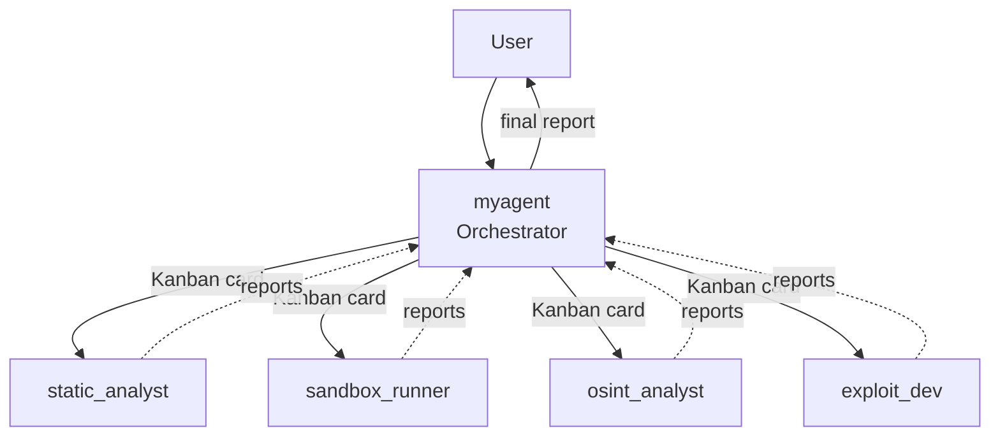

# Hermes Agent Multi-Profile Setup

Multi-agent Hermes configuration for CTF/RE orchestration and general-purpose assistance.

## Profiles

| Profile | Role |
|---------|------|
| `myagent` | Orchestrator. Delegates tasks to subagents via Kanban. |
| `exploit_dev` | Exploit development and payload crafting. |
| `osint_analyst` | OSINT / reconnaissance analysis. |
| `sandbox_runner` | Dynamic execution / sandboxed runtime. |
| `static_analyst` | Static binary / bytecode analysis. |

## Architecture



## Installation

```bash
git clone <this-repo>.git /tmp/hermes-profiles
cp -R /tmp/hermes-profiles/* ~/.hermes/profiles/
```

Each cloned folder must land directly under `~/.hermes/profiles/` so Hermes can discover it by profile name.

## Notes

- Do **not** commit `.env`, `logs/`, `sessions/`, or runtime state. Each profile directory includes its own `.gitignore`.
- `config.yaml` is shared as a template with secrets blanked out.
