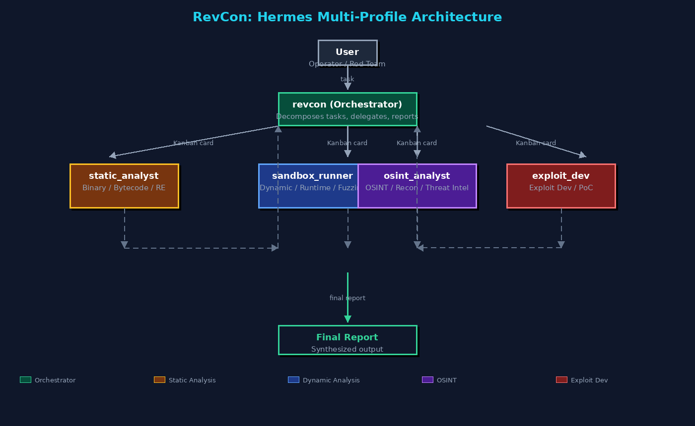

# Hermes Agent Multi-Profile Setup

Orchestrated multi-agent Hermes configuration for CTF/RE workflows and general-purpose task delegation — drop-in installable.

---

## Installation

Each folder below is a standalone Hermes profile. Copy them directly into `~/.hermes/profiles/`:

```bash
git clone <repo-url>.git /tmp/hermes-profiles
cp -R /tmp/hermes-profiles/* ~/.hermes/profiles/
```

After copying:
```bash
hermes profile revcon
```

---

## Profiles

| Directory | Role |
|-----------|------|
| `revcon/` | Orchestrator. Decomposes tasks into Kanban cards and delegates to subagents. |
| `static_analyst/` | Static binary, bytecode, and firmware analysis. |
| `sandbox_runner/` | Dynamic execution, sandboxed runtime, and fuzzing harnesses. |
| `osint_analyst/` | OSINT, reconnaissance, and threat-intel gathering. |
| `exploit_dev/` | Exploit development, payload crafting, and PoC generation. |

---

## Architecture



```
  User
    |
    v
  revcon (orchestrator)
    |
    +---> static_analyst  (static analysis)
    +---> sandbox_runner   (dynamic / runtime)
    +---> osint_analyst    (OSINT / recon)
    +---> exploit_dev      (exploit dev / payloads)
    |
    v
  Final synthesized report
```

`revcon` uses Hermes Kanban to assign cards to subagents, collects results, and produces the final report.

---

## What's Inside Each Profile

Each profile directory contains:

- `config.yaml` — Hermes config with secrets blanked out. Fill in your own API keys and provider settings.
- `SOUL.md` — Agent persona and task framing.
- `profile.yaml` — Profile metadata.
- `skills/` — Bundled skill catalog (see below).
- `memories/` — Starter memory files; overwritten at runtime.
- `scripts/` or `bin/` — Helper scripts and tools (if applicable).

### Bundled Skill Catalog

All profiles ship the full bundled skill tree (~500 files). Categories include:

- `autonomous-ai-agents` — Claude Code, Codex, OpenCode delegation
- `creative` — ASCII art, design systems, manim, p5js, touchdesigner
- `data-science` — Jupyter kernels, live data analysis
- `devops` — Kanban, multi-agent debugging, environment setup
- `email` — Himalaya CLI for IMAP/SMTP
- `github` — PRs, issues, reviews, repo management
- `media` — YouTube transcripts, GIF search, audio spectrograms
- `mlops` — HuggingFace, vLLM, llama.cpp, evaluation harnesses
- `note-taking` — Obsidian integration
- `productivity` — Google Workspace, Notion, Airtable, Maps, OCR, PowerPoint
- `re` — Reverse engineering: Ghidra triage, YARA, VirusTotal, bytecode analysis
- `research` — arXiv, Polymarket, paper writing
- `smart-home` — Philips Hue / OpenHue
- `social-media` — X/Twitter via xurl
- `software-development` — Hermes skill authoring, debugging, TDD, code review, systematic debugging
- `yuanbao` — Yuanbao groups integration

---

## Prerequisites

- Hermes Agent installed
- Profiles enabled in Hermes config (default: `~/.hermes/profiles/`)
- Optional for subagent workflows:
  - Docker / Singularity / Modal configured in `revcon/config.yaml`
  - Sandbox image built (e.g. `sandbox-ctf:latest`)
  - `tirith` binary placed in `revcon/bin/` and each subagent `bin/` if security scanning is desired

---

## Setup Workflow

1. Clone and copy profiles (see Installation).
2. Edit each `config.yaml`:
   - Set your model provider and API keys.
   - Configure delegation settings and subagent references.
3. Deploy runtime tools:
   - Build sandbox image.
   - Place `tirith` if using built-in scanning.
4. Switch to `revcon`:
   ```bash
   hermes profile revcon
   ```
5. Run a test delegation to verify subagent cards appear and complete.

---

## Runtime Files (Excluded)

Each profile has its own `.gitignore` blocking these paths:

- `.env`, `*.lock`, `*.log`, `*.db*`, `*.pid`, `*.bak.*`
- `sessions/`, `logs/`, `workspace/`, `cache/`
- `gateway/`, `plugins/`, `pairing/`, `hooks/`
- `images/`, `audio_cache/`, `image_cache/`
- `.hermes_history`, `auth.lock`, `*.json.lock`

Do not manually create these inside a profile directory; they’re generated by Hermes at runtime.

---

## Notes

- **Do not commit `.env`** — it contains your credentials.
- **Skill footprint is large** — if you need a slim profile, trim `skills/` to only the categories you need.
- **Copy, don’t symlink** — profiles must be real directories under `~/.hermes/profiles/`, not symlinks, for Hermes to discover them correctly.

---

## License

Private / organizational use.
